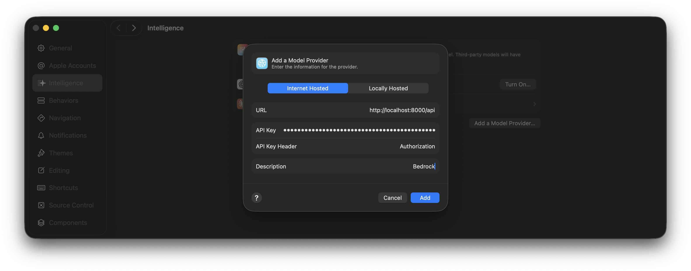
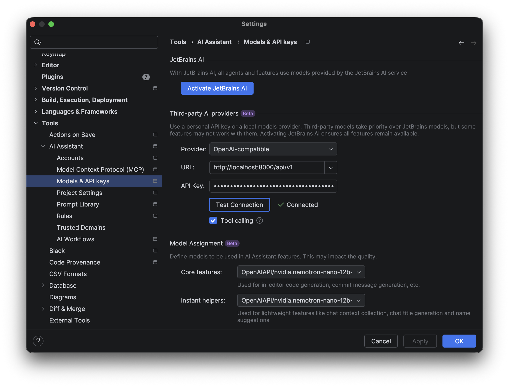

# AWS Bedrock for IDEs

Run AWS Bedrock models locally through an **OpenAI-compatible API**. This allows you to use Bedrock models (Claude, Llama, Mistral, etc.) with any tool that supports the OpenAI API format.

## Why Use This?

Many development tools and IDEs support AI assistants through the OpenAI API. This gateway lets you use AWS Bedrock models instead, giving you:

- Access to Claude, Llama, Mistral, and other Bedrock models
- Use your existing AWS credentials and billing
- No need for a separate OpenAI subscription
- Security - All LLM calls remain within your AWS account

## Prerequisites

- Docker
- AWS CLI configured with credentials
- AWS account with Bedrock model access enabled

## Quick Start

### 1. Run the setup script

Using the default AWS profile:
```bash
./setup.sh
```

Using a named AWS profile:
```bash
AWS_PROFILE=personal ./setup.sh
```

Using access keys:
```bash
AWS_ACCESS_KEY_ID=xxx AWS_SECRET_ACCESS_KEY=yyy ./setup.sh
```

The script will output an API key. **Save this key** - you'll need it to authenticate requests.

### 2. Test the API

```bash
API_KEY=<ENTER_API_KEY_HERE> curl -X 'POST' \
  'http://localhost:8000/api/v1/chat/completions' \
  -H 'accept: application/json' \
  -H "Authorization: Bearer $API_KEY" \
  -H 'Content-Type: application/json' \
  -d '{
  "model": "openai.gpt-oss-20b-1:0",
  "messages": [
    {
      "role": "system",
      "content": "You are a helpful assistant."
    },
    {
      "role": "user",
      "content": "Hello!"
    }
  ]
}'
```

## IDE Setup Guides

> **Note:** Each IDE requires a slightly different URL format. Follow the specific instructions for your IDE below.

### Xcode

Xcode supports AI coding assistants through custom OpenAI-compatible endpoints. To configure Xcode to use Bedrock:

1. Open **Xcode** → **Settings** (⌘,)
2. Go to the **Intelligence** tab
3. Click **Add Model Provider**
4. Configure the following:
   - **URL**: `http://localhost:8000/api`
   - **API Key**: `Bearer <your-api-key>` (include "Bearer " prefix)
   - **API Key Header**: `Authorization`



### IntelliJ IDEA (and other JetBrains IDEs)

JetBrains IDEs support AI assistants through plugins that can connect to OpenAI-compatible endpoints. First, [install the AI Assistant plugin](https://www.jetbrains.com/help/ai-assistant/installation-guide-ai-assistant.html) if you haven't already.

To configure IntelliJ to use Bedrock:

1. Open **Settings** (⌘, on macOS or Ctrl+Alt+S on Windows/Linux)
2. Navigate to **Tools** → **AI Assistant** → **Models** → **OpenAI API Compatible**
3. Click **+** to add a new provider and configure:
   - **URL**: `http://localhost:8000/api/v1`
   - **API Key**: The key from setup output (no "Bearer " prefix needed)
4. Click **OK** to save



## Configuration

The setup script supports these environment variables:

| Variable | Default | Description |
|----------|---------|-------------|
| `AWS_PROFILE` | - | AWS profile to use |
| `AWS_ACCESS_KEY_ID` | - | AWS access key (alternative to profile) |
| `AWS_SECRET_ACCESS_KEY` | - | AWS secret key (alternative to profile) |
| `AWS_REGION` | `us-east-1` | AWS region for Bedrock |
| `PORT` | `8000` | Local port to expose the API |

Example with custom port:
```bash
PORT=9000 AWS_PROFILE=personal ./setup.sh
```

## Scripts

| Script | Description |
|--------|-------------|
| `setup.sh` | Clones repo, builds Docker image, creates API key, starts container |
| `start.sh` | Starts a stopped container |
| `stop.sh` | Stops the container |
| `restart.sh` | Restarts the container |
| `remove.sh` | Stops and removes the container |
| `logs.sh` | View container logs (supports docker logs flags, e.g. `./logs.sh -f`) |
| `get-api-key.sh` | Retrieve the API key from AWS SSM |
| `enable-anthropic.sh` | Submit the required use-case form for Anthropic models |

## Troubleshooting

**Container won't start**: Check Docker is running and you have valid AWS credentials.

**Authentication errors**: Ensure your AWS profile/keys have Bedrock access in the configured region.

**Model not found**: Verify the model is enabled in your AWS Bedrock console.

Check container logs:
```bash
./logs.sh
```

**Lost your API key?** Retrieve it from AWS SSM:
```bash
./get-api-key.sh
```

**Anthropic models return errors after working briefly**: If your account doesn't have Anthropic models enabled via the use-case form (directly or via a parent account), the models may work initially but then fail. Submit the required form:
```bash
./enable-anthropic.sh
```

## How It Works

This project uses [AWS Bedrock Access Gateway](https://github.com/aws-samples/bedrock-access-gateway), an AWS sample project that provides an OpenAI-compatible API layer on top of AWS Bedrock. The gateway translates OpenAI API calls into Bedrock API calls, allowing any tool that supports the OpenAI API format to work with Bedrock models.

The scripts in this repository simplify running the gateway locally via Docker, handling credential configuration and API key management through AWS SSM.
